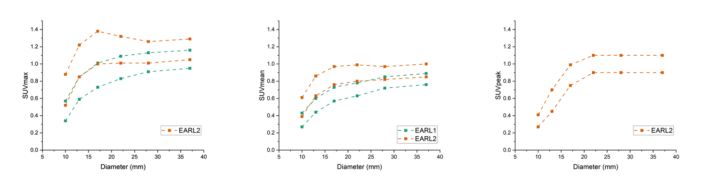

The EARL Accreditation is aimed at providing a comparable platform for comparing quantitative metrics between different PET scanners.

## Background

People use SUV as the semi-quantitative metric in PET imaging. However, SUV is highly susceptible to various parameters including biological influences (such as blood glucose level) as well as quantitative performance of the scanner and the image quality. All these cause the deviation of SUV. This poses a problem, as different acquisitions are difficult to be compared.

Thus, a set of standards has to be established to control various variables, including the whole process from instrumental calibration all the way to patient preparation.

## Procedure

EARL accreditation is based on the EANM recommendations. The first version of the recommendation, [FDG PET and PET/CT: EANM procedure guidelines for tumour PET imaging: version 1.0](https://www.eanm.org/publications/guidelines/gl_onco_fdgpet.pdf) specified the methods for SUV calibration, as well as the assessment of image quality and recovery coefficient. The guidelines later updated to the [2.0 version](https://link.springer.com/article/10.1007/s00259-014-2961-x) in 2014. However, the concrete procedure was not included in the updated version of guidelines.

A step-by-step procedure is available on the [EARL website](https://eanm-earl-wordpress.esh.netkey.at/wp-content/uploads/2021/04/EARL-procedure-for-optimizing-FDG-activity-for-quantitative-FDG-PET-studies_version_1_1.pdf), which is used alongside the original guidelines.

## Standard

| |  | EARL1 | EARL1 | EARL2 | EARL2 | EARL2 |
|:---:|:---:|:---:|:---:|:---:|:---:|:---:|
| Diam. (mm) | Vol.  (mL) | max | mean | max* | mean | peak** |
| 37 | 26.52 | 0.95 – 1.16 | 0.76 – 0.89 | 1.05 – 1.29 | 0.85 – 1.00 | 0.90 – 1.10 |
| 28 | 11.49 | 0.91 – 1.13 | 0.72 – 0.85 | 1.01 – 1.26 | 0.82 – 0.97 | 0.90 – 1.10 |
| 22 | 5.57 | 0.83 – 1.09 | 0.63 – 0.78 | 1.01 – 1.32 | 0.80 – 0.99 | 0.90 – 1.10 |
| 17 | 2.57 | 0.73 – 1.01 | 0.57 – 0.73 | 1.00 – 1.38 | 0.76 – 0.97 | 0.75 – 0.99 |
| 13 | 1.15 | 0.59 – 0.85 | 0.44 – 0.60 | 0.85 – 1.22 | 0.63 – 0.86 | 0.45 – 0.70 |
| 10 | 0.52 | 0.34 – 0.57 | 0.27 – 0.43 | 0.52 – 0.88 | 0.39 – 0.61 | 0.27 – 0.41 |

## Data analysis

### RC calculation

Steps to calculate the recovery coefficients.

- Obtain the theoretical SUV ($\mathrm{SUV}_\mathrm{theo}$) of the background and the spheres.
$$
\begin{aligned}
\mathrm{SUV}_\mathrm{theo}(\mathrm{Background}) = \frac{\mathrm{Dose}^\mathrm{adj}(\mathrm{Background})}{\mathrm{Dose}^\mathrm{adj}(\mathrm{Background})+\mathrm{Dose}^\mathrm{adj}(\mathrm{Spheres})}\times\frac{V(\mathrm{Background})+V(\mathrm{Spheres})}{V(\mathrm{Background})}\\
\mathrm{SUV}_\mathrm{theo}(\mathrm{Spheres}) = \frac{\mathrm{Dose}^\mathrm{adj}(\mathrm{Spheres})}{\mathrm{Dose}^\mathrm{adj}(\mathrm{Background})+\mathrm{Dose}^\mathrm{adj}(\mathrm{Spheres})}\times\frac{V(\mathrm{Background})+V(\mathrm{Spheres})}{V(\mathrm{Spheres})}\\\
\end{aligned}
$$
N.B. The dose has to be decay-adjusted (denoted by $\mathrm{Dose}^\mathrm{adj}$). The directly measurable quantities are $\mathrm{Dose}(\mathrm{Background}, t)$, $C(\mathrm{Spheres}, t)$, $V(\mathrm{Background})$, and $V(\mathrm{Spheres})$. The adjusted dose of spheres is obatined by:
$$\mathrm{Dose}^\mathrm{adj}(\mathrm{Spheres})=C^\mathrm{adj}(\mathrm{Spheres})\times V(\mathrm{Spheres})$$
- Determine the rough range of each sphere, and determine the voxel with the highest intensity $\mathrm{SUV}_\mathrm{max}(\mathrm{Sphere}_i)$ within the range.
- Use region growth to obtain the isocontour (A50 segmentation) corresponding to the following threshold ($T_i$):
$$T_i = 0.5\times\left[\mathrm{SUV}_\mathrm{max}(\mathrm{Sphere}_i)+\mathrm{SUV}_\mathrm{theo}(\mathrm{Background})\right]$$
- The $\mathrm{SUV}_\mathrm{mean}(\mathrm{Sphere}_i)$ is thus determined.
- According to [(Kaalep et al, 2017)](https://link.springer.com/article/10.1007/s00259-018-3977-4), $\mathrm{SUV}_\mathrm{peak}(\mathrm{Sphere}_i)$ is determined using a 3D VOI. A 3D 12 mm diameter spherical VOI centered on SUVmax is defined, and the average SUV in this area is calculated. The 12 mm diameter VOI may extend beyond the A50 segmentation.
- Use the following formulae to define recovery coefficients (RCs).
$$
\begin{aligned}
    \mathrm{RC}_\mathrm{mean}(\mathrm{Sphere}_i) &= \frac{\mathrm{SUV}_\mathrm{mean}(\mathrm{Sphere}_i)}{\mathrm{SUV}_\mathrm{theo}(\mathrm{Spheres})}\\
    \mathrm{RC}_\mathrm{max}(\mathrm{Sphere}_i) &= \frac{\mathrm{SUV}_\mathrm{max}(\mathrm{Sphere}_i)}{\mathrm{SUV}_\mathrm{theo}(\mathrm{Spheres})}\\
    \mathrm{RC}_\mathrm{peak}(\mathrm{Sphere}_i) &= \frac{\mathrm{SUV}_\mathrm{peak}(\mathrm{Sphere}_i)}{\mathrm{SUV}_\mathrm{theo}(\mathrm{Spheres})}
\end{aligned}
$$

## Other related methods

- CTN, Clinical Trial Network
- JSNM, Japan Society of Nuclear Medicine
